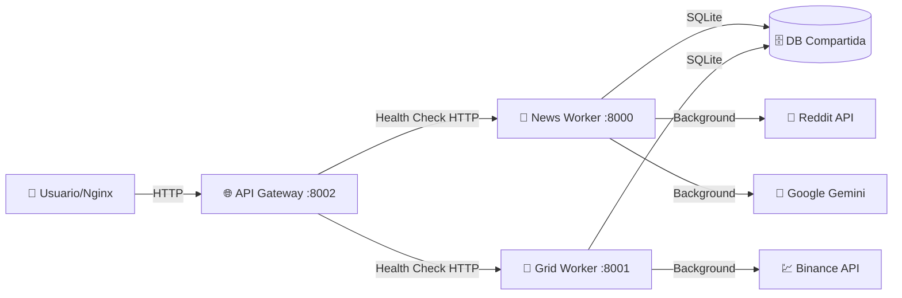

# 🔮 Oráculo Cripto Bot - Arquitectura de Pure Workers + API Gateway

Un sistema inteligente de **microservicios pure workers** para trading automatizado y análisis de noticias crypto con **API Gateway centralizado** y **health checks HTTP** en tiempo real.

## 📋 Descripción del Proyecto

El **Oráculo Cripto Bot** es un ecosistema de **pure workers** con **API Gateway centralizado** que combina **trading automatizado** y **análisis de sentimientos** de noticias cripto. La arquitectura está diseñada como **microservicios modernos** donde cada worker es independiente y el gateway agrega su estado mediante **health checks HTTP**.

### 🎯 Arquitectura: Pure Workers + Gateway Centralizado

#### 📰 News Worker (Puerto 8000)
- **Recolección Automática**: Reddit (r/CryptoCurrency) cada hora
- **Análisis de Sentimientos**: Google Gemini AI cada 4 horas  
- **Background Jobs**: Schedulers independientes
- **Minimal API**: Solo `/health` para monitoreo

#### 🤖 Grid Worker (Puerto 8001)
- **Grid Trading Bot**: Estrategias automatizadas en Binance
- **Trading 24/7**: Operaciones continuas con gestión de riesgos
- **Background Jobs**: Schedulers de trading independientes
- **Minimal API**: Solo `/health` para monitoreo

#### 🌐 API Gateway (Puerto 8002)
- **Único Punto HTTP**: Entrada pública centralizada
- **Health Checks Agregados**: Estado de todos los workers vía HTTP
- **Monitoreo Centralizado**: `/api/v1/health` agrega todo el sistema
- **Communication Hub**: Comunica con workers via `localhost:8000` y `localhost:8001`

### 🏗️ Arquitectura Final Optimizada

```
oraculo_bot/
├── services/                    # 🔥 MICROSERVICIOS PURE WORKERS
│   ├── api/                     # 🌐 API Gateway (Puerto 8002) - PÚBLICO
│   │   ├── main.py              # Entry point único HTTP
│   │   └── routers/
│   │       └── status_router.py # Health checks agregados HTTP
│   ├── news/                    # 📰 News Worker (Puerto 8000) - WORKER PURO
│   │   ├── main.py              # Minimal FastAPI + Background jobs
│   │   ├── schedulers/          # Reddit + Sentiment analysis jobs
│   │   └── services/            # Reddit API + Google Gemini AI
│   └── grid/                    # 🤖 Grid Worker (Puerto 8001) - WORKER PURO
│       ├── main.py              # Minimal FastAPI + Trading jobs
│       ├── schedulers/          # Grid trading background jobs
│       ├── core/                # Trading engine
│       └── strategies/          # Trading algorithms
├── shared/                      # 🧩 CÓDIGO COMPARTIDO
│   ├── config/                  # Configuración centralizada
│   ├── database/                # SQLite compartido (sentimientos)
│   └── services/                # Logging + Telegram compartidos
├── run_api_service.py           # 🚀 Entry point API Gateway
├── run_news_service.py          # 🚀 Entry point News Worker
├── run_grid_service.py          # 🚀 Entry point Grid Worker
└── requirements.txt             # Dependencias (incluye aiohttp)
```

### 🔗 Comunicación Entre Microservicios



#### 🔧 Flujo de Health Checks

1. **API Gateway** (Puerto 8002) hace HTTP requests a:
   - `http://localhost:8000/health` (News Worker)
   - `http://localhost:8001/health` (Grid Worker)

2. **Endpoint Agregado** `/api/v1/health` retorna estado completo:
   ```json
   {
     "system_status": "healthy",
     "summary": "3/3 servicios saludables",
     "services": [
       {"service": "api_gateway", "status": "healthy", "url": "localhost:8002"},
       {"service": "news", "status": "healthy", "url": "localhost:8000"},
       {"service": "grid", "status": "healthy", "url": "localhost:8001"}
     ]
   }
   ```

## 🚀 Instalación y Configuración

### 📋 Prerrequisitos

- Python 3.8 o superior
- pip (gestor de paquetes de Python)
- **Cuenta de Reddit** para API credentials
- **Google API Key** para análisis de sentimientos con Gemini
- **Cuenta de Binance** para trading (opcional)
- **Bot de Telegram** para notificaciones (opcional)

### 🔧 Instalación Local

1. **Clonar el repositorio**:
   ```bash
   git clone <url-del-repositorio>
   cd oraculo_bot
   ```

2. **Crear y activar el entorno virtual**:
   ```bash
   # En Windows
   python -m venv venv
   venv\Scripts\activate

   # En macOS/Linux
   python3 -m venv venv
   source venv/bin/activate
   ```

3. **Instalar las dependencias**:
   ```bash
   pip install -r requirements.txt
   ```

4. **Configurar variables de entorno**:
   
   Crear un archivo `.env` en la raíz del proyecto:
   ```env
   # Configuración General
   PROJECT_NAME=Oráculo Cripto Bot
   DATABASE_URL=sqlite:///./oraculo.db
   
   # Reddit API (para noticias)
   REDDIT_CLIENT_ID=tu_client_id_aqui
   REDDIT_CLIENT_SECRET=tu_client_secret_aqui
   REDDIT_USER_AGENT=OraculoBot by tu_usuario_de_reddit
   
   # Google Gemini API (para análisis de sentimientos)
   GOOGLE_API_KEY=tu_google_api_key_aqui
   
   # Binance API (para trading)
   BINANCE_API_KEY=tu_binance_api_key_aqui
   BINANCE_SECRET_KEY=tu_binance_secret_key_aqui
   
   # Telegram Bot (para notificaciones)
   TELEGRAM_BOT_TOKEN=tu_telegram_bot_token
   TELEGRAM_CHAT_ID=tu_chat_id
   ```

## 🎮 Ejecución del Proyecto

### 🔥 Ejecutar Pure Workers + API Gateway

```bash
# 📰 News Worker (Puerto 8000) - Background jobs
python run_news_service.py

# 🤖 Grid Trading Worker (Puerto 8001) - Background jobs  
python run_grid_service.py

# 🌐 API Gateway (Puerto 8002) - HTTP público
python run_api_service.py
```

### 🌐 URLs del Sistema

- **🌐 API Gateway**: http://localhost:8002 (ÚNICO PUNTO PÚBLICO)
  - **Documentación**: http://localhost:8002/docs
  - **Health Check Sistema**: http://localhost:8002/api/v1/health
  - **Lista Workers**: http://localhost:8002/api/v1/services
- **📰 News Worker**: http://localhost:8000/health (INTERNO)
- **🤖 Grid Worker**: http://localhost:8001/health (INTERNO)

### 📡 Endpoints del API Gateway Centralizado

#### 🌐 Sistema (`/api/v1/`)
| Método | Endpoint | Descripción |
|--------|----------|-------------|
| GET | `/` | Información general del sistema y arquitectura |
| GET | `/api/v1/health` | **Health check agregado** de todos los workers |
| GET | `/api/v1/services` | Lista de workers y sus puertos |
| GET | `/api/v1/` | Estado general y información arquitectónica |

#### 🔍 Ejemplos de Monitoreo

1. **Health check completo del sistema**:
   ```bash
   curl http://localhost:8002/api/v1/health
   ```
   
   **Respuesta**: Estado agregado de todos los workers con comunicación HTTP real

2. **Lista de workers disponibles**:
   ```bash
   curl http://localhost:8002/api/v1/services
   ```

3. **Información del sistema**:
   ```bash
   curl http://localhost:8002/
   ```

4. **Health check individual de worker** (interno):
   ```bash
   curl http://localhost:8000/health  # News Worker
   curl http://localhost:8001/health  # Grid Worker
   ```

## 🐳 Deployment en VPS

### 🛠️ Configuración con Systemd (Pure Workers)

El proyecto mantiene compatibilidad con systemd services en `deployment/services/`:

```bash
# Copiar archivos de servicio
sudo cp deployment/services/*.service /etc/systemd/system/

# Habilitar servicios (workers independientes)
sudo systemctl enable oraculo-news    # News Worker (Puerto 8000)
sudo systemctl enable oraculo-grid    # Grid Worker (Puerto 8001)  
sudo systemctl enable oraculo-api     # API Gateway (Puerto 8002)

# Iniciar servicios
sudo systemctl start oraculo-news
sudo systemctl start oraculo-grid  
sudo systemctl start oraculo-api

# Verificar estado
sudo systemctl status oraculo-*
```

### 🌐 Configuración Nginx (Solo API Gateway Público)

```nginx
server {
    listen 80;
    server_name tu-dominio.com;

    # Solo exponer API Gateway público
    location / {
        proxy_pass http://localhost:8002;
        proxy_set_header Host $host;
        proxy_set_header X-Real-IP $remote_addr;
    }
    
    # Workers internos no expuestos públicamente
    # News Worker (8000) y Grid Worker (8001) solo acceso local
}
```

### 📊 Monitoreo en VPS

```bash
# Health check agregado (muestra estado de todos los workers)
curl http://tu-vps:8002/api/v1/health

# Logs de servicios independientes
journalctl -u oraculo-news -f    # News Worker logs
journalctl -u oraculo-grid -f    # Grid Worker logs
journalctl -u oraculo-api -f     # API Gateway logs

# Estado de workers
sudo systemctl status oraculo-*
```

## 🛠️ Tecnologías Utilizadas

### 🚀 Framework y Comunicación
- **[FastAPI](https://fastapi.tiangolo.com/)**: Framework para API Gateway y workers
- **[aiohttp](https://docs.aiohttp.org/)**: **Health checks HTTP** entre servicios
- **[SQLAlchemy](https://www.sqlalchemy.org/)**: ORM compartido
- **[SQLite](https://www.sqlite.org/)**: Base de datos compartida
- **[APScheduler](https://apscheduler.readthedocs.io/)**: Background jobs en workers

### 🤖 Integrations
- **[PRAW](https://praw.readthedocs.io/)**: Reddit API integration
- **[Google Gemini](https://ai.google.dev/)**: Análisis de sentimientos con IA
- **[Binance API](https://github.com/sammchardy/python-binance)**: Trading automatizado
- **[python-telegram-bot](https://python-telegram-bot.org/)**: Notificaciones

### 🔧 Infraestructura
- **[Uvicorn](https://www.uvicorn.org/)**: Servidor ASGI para cada worker
- **[Pydantic](https://pydantic-docs.helpmanual.io/)**: Validación de datos
- **Systemd**: Gestión de servicios en VPS

## 🔮 Características Avanzadas

### 🤖 Pure Workers Architecture
- **Independent Processes**: Cada worker es un proceso separado
- **Minimal APIs**: Solo endpoints `/health` para monitoreo
- **Background Focus**: Lógica de negocio en background jobs
- **Fault Isolation**: Fallos en un worker no afectan otros

### 🌐 API Gateway Centralizado
- **Single Entry Point**: Un solo puerto público (8002)
- **Health Aggregation**: Comunica con workers vía HTTP
- **Service Discovery**: Conoce ubicación de todos los workers
- **Monitoring Hub**: Dashboard centralizado del sistema

### 🔗 Inter-Service Communication
- **HTTP Health Checks**: Comunicación real entre servicios
- **Timeout Handling**: 5 segundos timeout para health checks
- **Parallel Checks**: Verifica todos los workers simultáneamente
- **Graceful Degradation**: Sistema funciona aunque un worker falle

### 🛡️ Monitoring y Observabilidad
- **Aggregated Health**: Un endpoint muestra estado de todo
- **Individual Health**: Cada worker expone su estado
- **Service Discovery**: Lista automática de workers disponibles
- **Error Isolation**: Errores no se propagan entre servicios

## 🔮 Roadmap y Funcionalidades Futuras

### 🚀 Arquitectura
- **Kubernetes Deployment**: Migración a K8s con health checks
- **Load Balancing**: Múltiples instancias de workers
- **Service Mesh**: Istio para comunicación avanzada
- **Distributed Tracing**: OpenTelemetry para observabilidad

### 🧠 Workers Adicionales
- **Sentiment Aggregator Worker**: Análisis de sentimientos agregados
- **Notification Worker**: Worker dedicado para notificaciones
- **Analytics Worker**: Métricas y analytics en tiempo real
- **Alert Worker**: Sistema de alertas inteligentes

### 🔗 Integraciones Futuras
- **Multiple Exchanges**: Más exchanges de trading
- **Social Media Workers**: Twitter, Discord, Telegram sentiment
- **News API Workers**: Más fuentes de noticias crypto
- **DeFi Protocol Workers**: Integración con protocolos DeFi

## 🤝 Contribuciones

Las contribuciones son bienvenidas. El proyecto sigue **arquitectura de pure workers**:

1. Haz fork del proyecto
2. Crea una rama para tu feature (`git checkout -b feature/nueva-funcionalidad`)
3. **Desarrolla workers puros**: Enfócate en background jobs, no APIs complejas
4. **Mantén health checks**: Agrega `/health` a nuevos workers
5. **Actualiza API Gateway**: Si necesitas nuevos endpoints de monitoreo
6. Commit tus cambios (`git commit -am 'Agregar nueva funcionalidad'`)
7. Push a la rama (`git push origin feature/nueva-funcionalidad`)
8. Abre un Pull Request

## 📝 Licencia

Este proyecto está bajo la Licencia MIT. Ver el archivo `LICENSE` para más detalles.

---

## 🏆 Pure Workers + API Gateway Architecture

**El Oráculo Cripto Bot** representa una implementación moderna de **pure workers** con **API Gateway centralizado**, donde cada worker se enfoca en sus background jobs específicos y el gateway agrega su estado mediante **health checks HTTP reales**. 

Esta arquitectura garantiza:
- ✅ **Separación total** de responsabilidades
- ✅ **Comunicación HTTP** real entre servicios  
- ✅ **Monitoreo centralizado** agregado
- ✅ **Fault isolation** completo
- ✅ **Escalabilidad independiente** por worker

**Desarrollado con ❤️ para arquitectura de microservicios moderna y trading automatizado** 